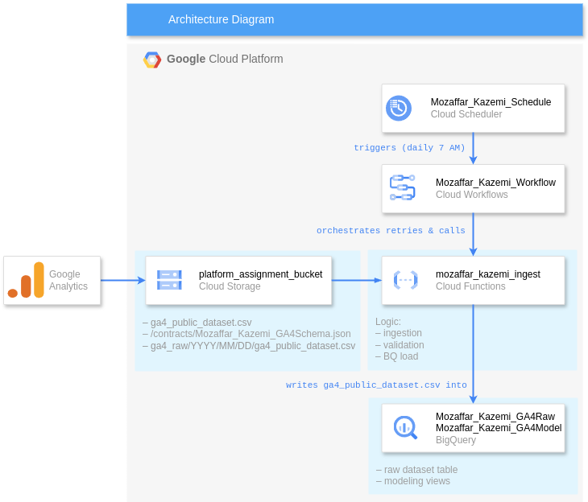

# GA4 Daily Ingestion Pipeline

> - **Mozaffar Kazemi** • Intern Candidate at Crystalloids
> - Last updated: 2025-05-08

An automated, production‑grade data pipeline on Google Cloud Platform that ingests daily GA4 CSV exports from Cloud Storage into BigQuery, applies validation and quality gates, and exposes analytic views for business insights.

---

## Table of Contents

- [GA4 Daily Ingestion Pipeline](#ga4-daily-ingestion-pipeline)
  - [Table of Contents](#table-of-contents)
  - [Project Overview](#project-overview)
  - [Architecture Diagram](#architecture-diagram)
  - [Prerequisites](#prerequisites)
  - [Folder Structure](#folder-structure)
  - [Setup \& Deployment](#setup--deployment)
  - [Usage \& Testing](#usage--testing)
  - [Analytics Layer](#analytics-layer)
  - [Documentation](#documentation)
  - [Contributing](#contributing)
  - [License](#license)

---

## Project Overview

The **GA4 Daily Ingestion Pipeline** automatically:

1. **Ingests** a static-named CSV (`ga4_public_dataset.csv`) dropped daily at 07:00 CET into
   `gs://platform_assignment_bucket/ga4_raw/YYYY/MM/DD/`.
2. **Validates** header schema, file size against yesterday (±5 % warn, ±20 % fail), and data quality.
3. **Loads** cleaned data into BigQuery managed table
   `Mozaffar_Kazemi_GA4Raw.Mozaffar_Kazemi_DailyEvents` with `WRITE_APPEND`.
4. **Provides** analytic views: daily KPIs, flattened event params, and top page titles.
5. **Orchestrates** via Cloud Workflows, scheduled by Cloud Scheduler at 07:00 CET.

---

## Architecture Diagram



> Components:
>
> * **Cloud Storage**: landing + partitioned folder layout
> * **Cloud Function** (`mozaffar_kazemi_ingest`): ingestion, validation & BQ load
> * **Cloud Workflows** (`Mozaffar_Kazemi_Workflow`): orchestrates retries
> * **Cloud Scheduler** (`Mozaffar_Kazemi_Schedule`): triggers workflows daily
> * **BigQuery**: raw dataset + modelling views

---

## Prerequisites

* GCP project `crystalloids-candidates` with region `europe-west4`
* Enabled APIs: Storage, BigQuery, Cloud Functions, Cloud Workflows, Cloud Scheduler
* IAM roles granted:

  * **Your user**: `roles/workflows.admin`, `roles/iam.serviceAccountUser`
  * **Scheduler SA** (`crystalloids-candidates@appspot.gserviceaccount.com`):
    `roles/workflows.invoker`, `roles/iam.serviceAccountTokenCreator`
  * **Terraform SA** (`platform-terraform-service-acc@…`): `roles/iam.serviceAccountTokenCreator`

---

## Folder Structure

```
ga4-daily-pipeline/
├── src/ingest/                  # Cloud Function code
│   ├── main.py                 # ingestion entrypoint
│   ├── bq_loader.py            # BigQuery load helper
│   ├── common.py               # structured logging helper
│   ├── ga4_csv_schema.json     # initial contract snapshot
│   └── requirements.txt        # Python dependencies
├── workflows/                  # Cloud Workflows definitions
│   └── ingest_workflow.yaml
├── sql/views/                  # BigQuery view definitions
│   ├── v_descriptive.sql
│   ├── v_page_metrics.sql
│   └── v_top_page_titles.sql
├── docs/                       # Project documentation
│   ├── incoming-files.md       # file contract & profile
│   ├── schedule.md             # workflow & scheduler details
│   ├── runbook_ingest.md       # run‑book & troubleshooting
│   └── architecture-diagram.png
├── scripts/                    # helper scripts
│   └── local_verify.sh         # lint & tests
└── README.md                   # this file
```

---

## Setup & Deployment

1. **Clone** this repo:

   ```bash
   git clone [git@github.com](mailto:git@github.com):<your-org>/ga4-daily-pipeline.git
   cd ga4-daily-pipeline
   ```


2. **Deploy Cloud Function**:
    ```bash
    cd src/ingest
    gcloud functions deploy mozaffar_kazemi_ingest \
    --gen2 --runtime=python312 --region=europe-west4 \
    --entry-point=main --source=. \
    --service-account=platform-terraform-service-acc@crystalloids-candidates.iam.gserviceaccount.com \
    --trigger-http --allow-unauthenticated --min-instances=0
    ```

3. **Deploy Workflow**:

   ```bash
    cd ../../workflows
    gcloud workflows deploy Mozaffar\_Kazemi\_Workflow&#x20;
    \--location=europe-west4 --source=ingest\_workflow\.yaml&#x20;
    \--set-env-vars INGEST\_URL=\$(gcloud functions describe mozaffar\_kazemi\_ingest --region=europe-west4 --format='value(serviceConfig.uri)')
   ```

4. **Schedule with Cloud Scheduler**:
    ```bash
    cd ../
    gcloud scheduler jobs create http Mozaffar_Kazemi_Schedule \
    --location=europe-west1 --schedule="0 7 * * *" \
    --time-zone="Europe/Amsterdam" \
    --http-method=POST \
    --uri="https://workflowexecutions.googleapis.com/v1/projects/$(gcloud config get-value project)/locations/europe-west4/workflows/Mozaffar_Kazemi_Workflow/executions" \
    --oidc-service-account-email=crystalloids-candidates@appspot.gserviceaccount.com \
    --oidc-token-audience="https://workflowexecutions.googleapis.com/v1/projects/$(gcloud config get-value project)/locations/europe-west4/workflows/Mozaffar_Kazemi_Workflow/executions"
    ```

5. **Verify** a manual run:

   ```bash
   curl -X POST \$(gcloud functions describe mozaffar\_kazemi\_ingest --region=europe-west4 --format='value(serviceConfig.uri)')
   ```

---

## Usage & Testing
- **Local quality gate**:
```bash
./scripts/local_verify.sh
````

* **Unit tests**: `pytest` covers prefix, schema, and BQ config.
* **SQL previews**: use `bq query --nouse_legacy_sql < sql/views/*.sql` to deploy or `bq head` to preview rows.

---

## Analytics Layer

* **`v_descriptive`**: daily KPIs (page views, active users, median USD)
* **`v_page_metrics`**: flatten nested GA4 params (`page_title`)
* **`v_top_page_titles`**: rank titles by total page views

---

## Documentation

Detailed docs in `docs/`:

* **incoming-files.md**: data contract & profiling
* **schedule.md**: workflow & scheduler config
* **runbook\_ingest.md**: backfill & troubleshooting

- [Data Contract & Validation](docs/incoming-files.md)
- [Run-book & Backfill](docs/runbook_ingest.md)
- [Scheduler & Workflow](docs/schedule.md)
- [Top 5 Challenges & Solutions](docs/challenges.md)
- [Implementation Summary](docs/implementation_summary.md)
- [Future Work & Potential Improvements](docs/future_work.md)

---

## Contributing

1. Fork the repo and create a feature branch.
2. Ensure linting (`ruff`) and formatting (`black`).
3. Run unit tests and SQL previews.
4. Submit a PR with your changes; include clear testing steps.

---

## License

MIT © Crystalloids

---